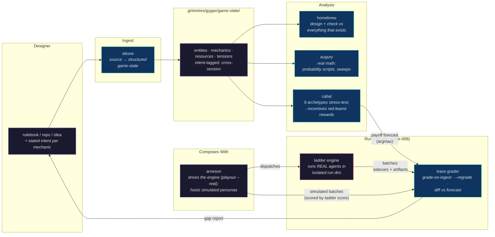
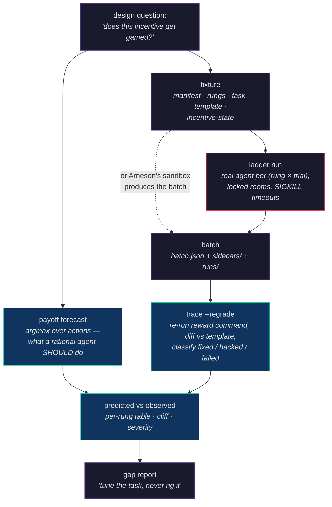
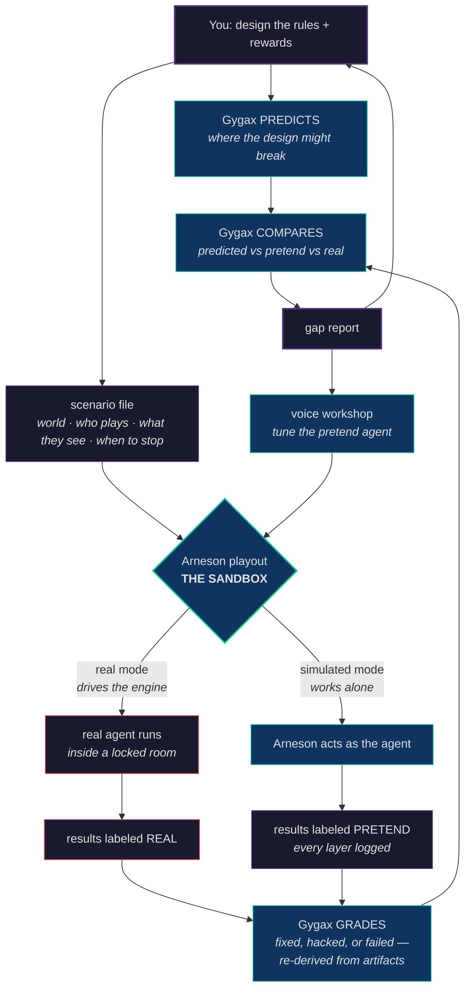

# Gygax

A game systems analyst for the [Loa](https://github.com/0xHoneyJar/loa) ecosystem.

You design a mechanic. Gygax tells you your stamina system doesn't regenerate in combat, so that dodge reaction you're excited about becomes a trap option after round two. You design a eurogame engine. Gygax tells you the big-money strategy dominates all engine-building. You draft an autobattler comp. Gygax tells you one synergy line has a 2x DPS multiplier over everything else. Before your players find out.

Built on [construct-base](https://github.com/0xHoneyJar/construct-base).



## Why

Designing a game is juggling interlocking systems in your head. Change one number and three mechanics break in ways you won't notice until someone finds the exploit. The feedback loop between "I think this works" and "oh, it definitely doesn't" is measured in weeks of real playtesting.

Gygax shortens that loop to minutes. Not by replacing playtesting — by catching the structural problems before anyone sits down to play.

**What makes it different from just asking an LLM about game design:**

- **It remembers.** Gygax maintains structured game-state across sessions. When you're designing your spell system, it still knows about your stamina system. When you're tuning your card economy, it still knows about your scoring paths. Cross-system interactions are where the real bugs hide.
- **It does math, not vibes.** "Seems overpowered" isn't actionable. "47 DPR against a 180 HP pool gives a TTK of 3.8 seconds" is. For non-dice games, it does structural analysis — slot contention ratios, conversion efficiency, decision-space mapping.
- **It argues with you.** Nine simulated player archetypes stress-test your design from every angle — the Optimizer finds the exploit, the Newcomer can't figure out the rules, the GM is drowning in cognitive load. Same archetypes work whether you're building a TTRPG, a eurogame, an autobattler, or a roguelike. They adapt their focus to your game's tradition.
- **It lets you explore.** Fork your game-state, try a change, see the consequences, compare alternatives. Commit the good branch, discard the rest. Design is branching, not linear.
- **It knows its own limits.** Gygax asks the designer for *intent* — what each mechanic is *supposed* to do — so analysis can distinguish a deliberate asymmetry from a bug. It compares against installed reference systems when you want to see how your design stacks up. And it runs real math via probability scripts when LLM reasoning would be unreliable.

## Commands

| Command | What It Does |
|---------|-------------|
| `/attune` | Point at a source — rulebook, repo, URL, or just describe your game — and Gygax builds structured game-state. Captures designer intent on tensions and key mechanics. |
| `/homebrew` | Design or refine a mechanic. Gygax checks it against everything that already exists, prompts for intent, logs rationale. |
| `/augury` | Run the numbers. Probability scripts handle dice pools, bell curves, advantage math, exploding dice. Cross-system comparison via `/augury compare --against 5e-srd`. **`--sweep`** analyzes a parametric tuning surface (engines), not just fixed stat blocks. |
| `/cabal` | Summon up to nine phantom players to stress-test your design with scenario walkthroughs. Intent-aware — deliberate asymmetries aren't flagged as bugs. **`--incentives`** red-teams an agent system's reward structure for reward hacks. |
| `/lore` | 460+ curated design heuristics across 20 traditions — TTRPGs, eurogames, autobattlers, roguelikes, deckbuilders, CCGs, tactics, 4X, and more. Learns per-game — patterns discovered in analysis can be captured and eventually promoted to curated. |
| `/scry` | Fork your game-state, explore a change, see the impact. Compare branches, commit the best one. Preserves intent across forks. |
| `/delve` | Analyze dungeons — ecology coherence, Xandering (non-linearity), attrition curves, loot economies, the G.U.A.R.D. framework. |
| `/gygax` | Where am I? What's in game-state? References installed, learned heuristics captured, recent reports. |

## Beyond games — engines and agent systems

The analytical core ("find where the curves break, where intent and reality diverge") isn't specific to
games. Gygax extends to two adjacent domains:

- **Engine tuning.** A game has fixed numbers; an *engine* has parameters and formulas a developer
  tunes. `/augury --sweep` analyzes the *tuning surface* — sweeps `model:` formulas across their
  domain, finds threshold crossings and spikes, and ranks the tuning knobs by leverage. One good
  tuning pass on an engine helps every game built on it. → [docs](src/pages/concepts/engine-tuning.mdx)
- **Agent incentive analysis.** Reward hacking *is* a dominant strategy. Point Gygax at an agent
  system's incentive structure and it forecasts where it'll be gamed — the reward hack, dead tools,
  specification gaming (the intended action is never optimal), and multi-agent coordination failure —
  then recommends the fix. The same payoff math that finds a degenerate game strategy finds a
  degenerate agent policy. → [docs](src/pages/concepts/agent-incentives.mdx)

> These are forecasts grounded in the declared model — Gygax predicts where a design *will* break, it
> doesn't replace running the real thing.

## From Forecast to Evidence

So Gygax also runs the real thing. `/cabal --incentives` forecasts what a rational agent *should*
do (argmax over the declared payoffs). The awareness-ladder engine then spawns real agents against
the same task — one per rung × trial, each in a locked run directory — and `/cabal --observed`
grades what they *actually did*, re-derived from artifacts (file diffs plus a re-run of the reward
command), never from the agent's self-report. The gap report diffs predicted vs observed, rung by
rung. Every finding carries a claim tag — observed beats simulation-derived beats forecast — and a
no-hack run is a finding, not a failure.



## Quick Start

**Claude Code** (one-liner):

```bash
curl -fsSL https://raw.githubusercontent.com/0xHoneyJar/construct-gygax/main/install.sh | bash
```

Run from your project root. Installs skills into `.claude/skills/`, creates grimoire structure, wires up identity. Then:

```
/attune
```

**With [Loa](https://github.com/0xHoneyJar/loa)**:

```
constructs install gygax
```

## Documentation

Full reference documentation lives under `src/pages/`, built with [Vocs](https://vocs.dev). Preview locally:

```bash
npm install
npm run dev      # http://localhost:5173
npm run build    # production output in dist/
npm run preview  # serve the built output
```

What's covered:

- **Welcome** — introduction, getting started, philosophy
- **Core Concepts** — game-state, the grimoire, designer intent, traditions, probability scripts, code-grounding (F1/F2/F4), engine tuning, agent incentive analysis
- **Commands** — full reference for every slash command (`/gygax`, `/attune`, `/homebrew`, `/augury`, `/cabal`, `/lore`, `/scry`, `/delve`)
- **Identity** — persona and voice, the seven refusals, expertise and boundaries
- **Reference** — the 9 Cabal archetypes, the 6 Augury layers, the 5 Delve frameworks, composition with Arneson and Loa

## The Cabal

`/cabal` is scenario-based playtest simulation. Nine archetypes walk through your design beat by beat — not just analyzing it from a distance, but experiencing it the way a player would. You compose the panel for each run.

| Archetype | What They Do |
|-----------|-------------|
| **The Optimizer** | Finds the degenerate strategy. Computes the most abusive build and checks if you intended it. |
| **The Explorer** | Wanders off the critical path. Tries every optional system and finds the dead design space. |
| **The Storyteller** | Asks whether mechanics serve the fiction. Finds where the drama dies. |
| **The Rules Lawyer** | Reads your text literally. Finds every ambiguity and undefined state. |
| **The Newcomer** | First time playing. Finds where your game fails to teach itself. |
| **The Chaos Agent** | Goes off-script. "I befriend the monster." Finds where no mechanic covers the action. |
| **The GM** | Runs the game behind the screen. Finds where cognitive load explodes. |
| **The Anxious Player** | Overwhelmed by choices. Finds where decision paralysis kills the fun. |
| **The Veteran** | 50 sessions deep. Finds where the game stops being interesting. |

Pick your panel: `/cabal --newcomer --gm --optimizer` tests accessibility, runnability, and exploitability. `/cabal --all` throws every lens at the design. No flags? Gygax picks a context-aware default based on what you're testing.

**Experience tracking.** Each archetype generates experience signals at every beat — confusion, excitement, dead time, decision paralysis, cognitive overload, mastery reward. When different archetypes have radically different experiences of the same moment (the Optimizer is thriving while the Newcomer is drowning), that's an **experience divergence** — an invisible fracture only visible by comparing across player types.

**Regression memory.** Each run checks previous reports. Did your fix for the Optimizer's exploit break something the Explorer was relying on?

For non-traditional games, the archetypes adapt. In a journaling RPG, the Optimizer finds prompt sequences that game the system. If an archetype genuinely can't engage with your game, that itself is a finding.

## Typical Flows

**Design loop:**
```
/attune  →  /homebrew  →  /augury  →  /cabal  →  iterate
```

**Explore-then-commit:**
```
/scry "what if threshold was 4?"  →  /scry "what if threshold was 5?"  →  /scry compare  →  /scry commit
```

**Cross-system comparison:**
```
/attune --reference 5e-srd  →  /augury compare DOSE vs 5e-srd:ability-score-cap
```

**Dungeon design review:**
```
/delve the-signal-mine  →  ecology + Xandering + attrition + loot + G.U.A.R.D. scorecard
```

1. **Attune** to your game (ingest a doc, capture intent on tensions)
2. **Homebrew** a mechanic (get cross-system consistency feedback)
3. **Augury** the math (real scripts, not vibes — bell curves, dice pools, exploding dice)
4. **Cabal** stress-test (intent-aware — deliberate asymmetries aren't flagged as bugs)
5. **Lore** pattern check (230+ curated heuristics plus patterns learned from your own game)
6. **Scry** alternatives (fork, test, compare, commit the best branch)
7. **Delve** your dungeons (ecology, non-linearity, attrition, loot, G.U.A.R.D.)
8. Fix what broke, repeat from 2

Every skill tells you what to do next. Augury finds a balance problem? It suggests the exact `/homebrew` invocation to fix it. Cabal finds an accessibility issue? It points you to `/homebrew` with the specific mechanic. Lore finds a novel structural pattern? It asks if you want to capture it as a learned heuristic.

You don't have to follow any order. `/cabal` a napkin sketch before you've done any balance work. `/scry` three alternative approaches before committing to one. Jump in wherever.

## Composition with Arneson

Gygax pairs with [construct-arneson](https://github.com/0xHoneyJar/construct-arneson). Gygax analyzes. Arneson plays. Together they form a complete design-and-play workbench. Apart, each works on its own.

### The Workbench Loop

One loop: design → predict → play → grade → compare → improve → repeat. The same
diagram lives in both repos — if they ever differ, that's a bug.



Three rules keep it honest: the judge never produces the evidence it judges; every
file says how it was made; pretend is a preview, real is the proof.

**The compose loop:**
```
/cabal (diagnostic — how would players receive this?)
  → designer edits mechanic via /homebrew
  → /braunstein (generative — play the change with a human GM)
  → /distill (compress the session into analyzable evidence)
  → /cabal --from-session (analyze what actually happened)
  → next iteration
```

**Two-axis intent.** Gygax owns mechanical intent (what the math should do). Arneson owns experiential intent (how it should feel). Both axes live on the same entity — `/homebrew` captures both; arneson reads the experiential axis for voicing and scene shaping.

**Cabal vs Braunstein.** These are complementary, not competing:

| | `/cabal` (Gygax) | `/braunstein` (Arneson) |
|---|---|---|
| Mode | Diagnostic | Generative |
| Scope | Full panel, simultaneous | One archetype, deep |
| GM | Simulated | Human in the loop |
| Output | Findings report | Transcript + structured sidecar |
| Purpose | "Will players break this?" | "What does it feel like to play this?" |

Cabal tells you the Newcomer will be confused at beat 3. Braunstein lets you sit across the table from the Newcomer and watch them be confused — then try something different.

**What cabal is not.** The nine archetypes are audience postures — how different players *receive* a design. They are not voice modes, character lenses, or generative filters. Putting archetype postures into a character's voice contaminates the testing apparatus. See `identity/refusals.yaml` for the full boundary.

## Cross-System Comparison

Install a reference system and compare your design against it:

```
/attune --reference 5e-srd         # Install the 5e SRD combat math baseline
/attune --reference pbta-baseline  # Install Apocalypse World core
/attune --reference cepheus-core   # Install Cepheus Engine 2d6 SRD
```

Then:

```
/augury compare --against 5e-srd              # Full-spectrum comparison
/augury compare my-dodge vs 5e-srd:shield     # Entity-level comparison
```

The comparison report shows numerical deltas (CDF overlays, probability differences), experience deltas (how the designs feel different to play), and a narrative summary of what the differences mean.

## Designer Intent

Gygax reads your *intent* before classifying findings. When you build a game, some asymmetries are bugs. Others are the whole point. Gygax can't tell the difference without you.

Set intent on a tension:

```yaml
# tensions/instinct-vs-craft.yaml
intent:
  summary: "The inversion IS the game."
  rationale: "Freetekno succeeding through craft is the core dramatic tension — friction between identity and success method generates character moments on every roll."
  non_negotiable: true
```

Now when augury sees the 66.7% asymmetry, it reports it as an Observation ("working as designed per intent"), not a Warning. Critical findings never suppress — math can't be intentionally broken. But "this is unusual" vs "this is deliberate" is a distinction Gygax can't make without your help.

## Works With Any Game

Gygax has curated design heuristics across 20 traditions:

**TTRPGs:**
- **d20** — D&D, Pathfinder, 13th Age
- **Powered by the Apocalypse** — Dungeon World, Masks, Monsterhearts
- **Forged in the Dark** — Blades in the Dark, Scum and Villainy
- **Old School Renaissance** — OSE, Knave, Cairn, Into the Odd
- **Cepheus / Traveller** — 2d6+Effect sci-fi with lifepath and Age of Sail philosophy
- **Freeform / narrative-first** — Wanderhome, Belonging Outside Belonging

**Board & card games:**
- **Eurogame** — Agricola, Brass, Terraforming Mars
- **Deckbuilder** — Dominion, Star Realms, Aeon's End
- **CCG/TCG** — Magic: the Gathering, Hearthstone, Marvel Snap
- **Cooperative** — Pandemic, Spirit Island, Hanabi
- **Social deduction** — Blood on the Clocktower, Werewolf, Secret Hitler

**Digital game design:**
- **Autobattler** — TFT, Super Auto Pets, Storybook Brawl
- **Roguelike** — Slay the Spire, Hades, Balatro
- **Tactics** — XCOM, Into the Breach, Fire Emblem
- **4X** — Civilization, Stellaris, Endless Legend
- **Idle/Incremental** — Cookie Clicker, Melvor Idle
- **Extraction** — Escape from Tarkov, Dark and Darker
- **Looter** — Diablo, Path of Exile, Destiny
- **Immersive sim** — Deus Ex, Prey, Dishonored

The same analytical tools work across all of them. Augury's six analytical layers (resolution, action economy, resource economy, progression, pacing, cognitive load) apply whether you're checking dice probability in a TTRPG or conversion efficiency in a eurogame. The nine cabal archetypes test the same player mindsets — the Optimizer finds the dominant strategy, the Newcomer hits the onboarding wall, the Veteran tests long-term depth — with behavioral weightings that adapt to each tradition.

For games that don't fit any tradition, use `custom`. Gygax falls back to structural analysis: decision space, loop completeness, player agency, emotional arc. Heuristics that fire on your specific game can be captured as learned lore and — once proven across multiple games — promoted to the curated library.

The goal is always the same: does this design do what you think it does?

## What Gygax Is Not

- **Not a code generator.** It doesn't write your game. It analyzes and advises.
- **Not a writer.** No flavor text, no narrative prose, no lore.
- **Not a replacement for real playtesting.** It supplements with structural analysis. Real players will always surprise you in ways a simulation can't.
- **Not omniscient.** It will tell you when it doesn't know enough about a genre or tradition to have a strong opinion, rather than guessing.

## The Grimoire

Everything Gygax produces is saved as clean, presentable markdown in `grimoires/gygax/`. Hand someone the directory and they have the complete design journal — game-state, design documents, balance reports, playtest walkthroughs, lore scans, design branches. No conversation context needed.

## Scope

Any game with systems to analyze. TTRPGs, board games, card games, digital game design documents, autobattlers, roguelikes, tactics games, idle games — if the design can exist in a repo, Gygax can work with it.

## License

MIT
