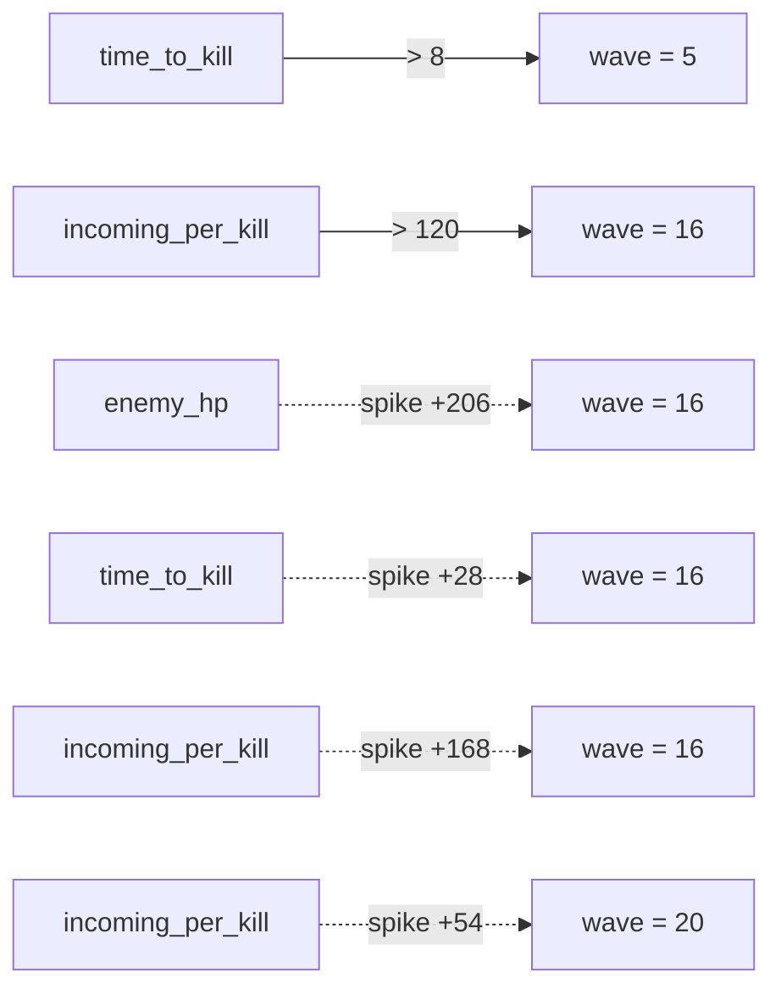

# Parametric Sweep — variable `wave`, domain 1–20

_Generated by Gygax `/augury --sweep`. Numeric sweep + first-crossing & spike detection — no symbolic solving._

## Threshold Crossings (2)

| Metric | Threshold | First crossing |
|--------|-----------|----------------|
| `time_to_kill` | > 8 | `wave = 5` (value 9) |
| `incoming_per_kill` | > 120 | `wave = 16` (value 270) |

## Spikes — threshold-free drastic jumps (4)

| Metric | At | Jump | × local trend |
|--------|----|------|---------------|
| `enemy_hp` | `wave = 16` | +206 → 356 | 34.3× |
| `time_to_kill` | `wave = 16` | +28 → 45 | 28.0× |
| `incoming_per_kill` | `wave = 16` | +168 → 270 | 30.5× |
| `incoming_per_kill` | `wave = 20` | +54 → 336 | 9.0× |

## Tuning Knobs — leverage ranking (FR-2)

| Rank | Knob | Leverage (Σ\|Δ time_to_kill\|) | Direction | Crossover-mover (L4) | Note |
|-----:|------|----------------------:|-----------|---------------------|------|
| 1 | `enemy-armor` | 51 | increases | -1 on `wave` |  |
| 2 | `player-attack` | 40 | decreases | +2 on `wave` |  |
| 3 | `enemy-hp` | 4 | increases | no shift |  |
| 4 | `enemy-attack` | 0 | none | no shift | low leverage on time_to_kill, but moves incoming_per_kill — do not dismiss (may sit on a loop/gate; FR-4). |
| 5 | `heal-value` | 0 | none | no shift | low leverage on time_to_kill, but moves heal_ratio — do not dismiss (may sit on a loop/gate; FR-4). |

**Balance findings — false levers (not knobs):**
- `player-max-hp` has no measurable effect on any metric — a false lever (does nothing, or is miswired). Remove it or wire it in; it is not a tuning knob.

## Tunability Framing (7)

**Engine-default — yours to tune (here are the levers):**
- `enemy-armor`
- `enemy-attack`
- `enemy-hp`
- `heal-value`
- `player-attack`
- `player-max-hp`

**Structural — genuine engine constraints (not knobs):**
- `damage-formula`

## Visualizations

### Metric curves

**`enemy_armor`** (model) — 20 pt, 0→4

<svg xmlns="http://www.w3.org/2000/svg" viewBox="0 0 240 60" width="240" height="60" role="img" aria-label="enemy_armor curve"><title>enemy_armor</title><polyline points="4.00,56.00 16.21,56.00 28.42,56.00 40.63,43.00 52.84,43.00 65.05,43.00 77.26,43.00 89.47,30.00 101.68,30.00 113.89,30.00 126.11,30.00 138.32,17.00 150.53,17.00 162.74,17.00 174.95,17.00 187.16,4.00 199.37,4.00 211.58,4.00 223.79,4.00 236.00,4.00" fill="none" stroke="#3b82f6" stroke-width="1.5" /><circle cx="4.00" cy="56.00" r="1.5" fill="#3b82f6" /><circle cx="236.00" cy="4.00" r="1.5" fill="#3b82f6" /></svg>

**`enemy_attack`** (model) — 20 pt, 3→7

<svg xmlns="http://www.w3.org/2000/svg" viewBox="0 0 240 60" width="240" height="60" role="img" aria-label="enemy_attack curve"><title>enemy_attack</title><polyline points="4.00,56.00 16.21,56.00 28.42,56.00 40.63,56.00 52.84,43.00 65.05,43.00 77.26,43.00 89.47,43.00 101.68,43.00 113.89,30.00 126.11,30.00 138.32,30.00 150.53,30.00 162.74,30.00 174.95,17.00 187.16,17.00 199.37,17.00 211.58,17.00 223.79,17.00 236.00,4.00" fill="none" stroke="#3b82f6" stroke-width="1.5" /><circle cx="4.00" cy="56.00" r="1.5" fill="#3b82f6" /><circle cx="236.00" cy="4.00" r="1.5" fill="#3b82f6" /></svg>

**`enemy_hp`** (model) — 20 pt, 66→380

<svg xmlns="http://www.w3.org/2000/svg" viewBox="0 0 240 60" width="240" height="60" role="img" aria-label="enemy_hp curve"><title>enemy_hp</title><polyline points="4.00,56.00 16.21,55.01 28.42,54.01 40.63,53.02 52.84,52.03 65.05,51.03 77.26,50.04 89.47,49.04 101.68,48.05 113.89,47.06 126.11,46.06 138.32,45.07 150.53,44.08 162.74,43.08 174.95,42.09 187.16,7.97 199.37,6.98 211.58,5.99 223.79,4.99 236.00,4.00" fill="none" stroke="#3b82f6" stroke-width="1.5" /><circle cx="4.00" cy="56.00" r="1.5" fill="#3b82f6" /><circle cx="236.00" cy="4.00" r="1.5" fill="#3b82f6" /></svg>

**`heal_value`** (model) — 20 pt, 20→20

<svg xmlns="http://www.w3.org/2000/svg" viewBox="0 0 240 60" width="240" height="60" role="img" aria-label="heal_value curve"><title>heal_value</title><polyline points="4.00,30.00 16.21,30.00 28.42,30.00 40.63,30.00 52.84,30.00 65.05,30.00 77.26,30.00 89.47,30.00 101.68,30.00 113.89,30.00 126.11,30.00 138.32,30.00 150.53,30.00 162.74,30.00 174.95,30.00 187.16,30.00 199.37,30.00 211.58,30.00 223.79,30.00 236.00,30.00" fill="none" stroke="#3b82f6" stroke-width="1.5" /><circle cx="4.00" cy="30.00" r="1.5" fill="#3b82f6" /><circle cx="236.00" cy="30.00" r="1.5" fill="#3b82f6" /></svg>

**`player_attack`** (model) — 20 pt, 12→12

<svg xmlns="http://www.w3.org/2000/svg" viewBox="0 0 240 60" width="240" height="60" role="img" aria-label="player_attack curve"><title>player_attack</title><polyline points="4.00,30.00 16.21,30.00 28.42,30.00 40.63,30.00 52.84,30.00 65.05,30.00 77.26,30.00 89.47,30.00 101.68,30.00 113.89,30.00 126.11,30.00 138.32,30.00 150.53,30.00 162.74,30.00 174.95,30.00 187.16,30.00 199.37,30.00 211.58,30.00 223.79,30.00 236.00,30.00" fill="none" stroke="#3b82f6" stroke-width="1.5" /><circle cx="4.00" cy="30.00" r="1.5" fill="#3b82f6" /><circle cx="236.00" cy="30.00" r="1.5" fill="#3b82f6" /></svg>

**`player_max_hp`** (model) — 20 pt, 120→120

<svg xmlns="http://www.w3.org/2000/svg" viewBox="0 0 240 60" width="240" height="60" role="img" aria-label="player_max_hp curve"><title>player_max_hp</title><polyline points="4.00,30.00 16.21,30.00 28.42,30.00 40.63,30.00 52.84,30.00 65.05,30.00 77.26,30.00 89.47,30.00 101.68,30.00 113.89,30.00 126.11,30.00 138.32,30.00 150.53,30.00 162.74,30.00 174.95,30.00 187.16,30.00 199.37,30.00 211.58,30.00 223.79,30.00 236.00,30.00" fill="none" stroke="#3b82f6" stroke-width="1.5" /><circle cx="4.00" cy="30.00" r="1.5" fill="#3b82f6" /><circle cx="236.00" cy="30.00" r="1.5" fill="#3b82f6" /></svg>

**`damage_per_hit`** (metric) — 20 pt, 8→12

<svg xmlns="http://www.w3.org/2000/svg" viewBox="0 0 240 60" width="240" height="60" role="img" aria-label="damage_per_hit curve"><title>damage_per_hit</title><polyline points="4.00,4.00 16.21,4.00 28.42,4.00 40.63,17.00 52.84,17.00 65.05,17.00 77.26,17.00 89.47,30.00 101.68,30.00 113.89,30.00 126.11,30.00 138.32,43.00 150.53,43.00 162.74,43.00 174.95,43.00 187.16,56.00 199.37,56.00 211.58,56.00 223.79,56.00 236.00,56.00" fill="none" stroke="#3b82f6" stroke-width="1.5" /><circle cx="4.00" cy="4.00" r="1.5" fill="#3b82f6" /><circle cx="236.00" cy="56.00" r="1.5" fill="#3b82f6" /></svg>

**`time_to_kill`** (metric) — 20 pt, 6→48

<svg xmlns="http://www.w3.org/2000/svg" viewBox="0 0 240 60" width="240" height="60" role="img" aria-label="time_to_kill curve"><title>time_to_kill</title><line x1="52.84" y1="4.00" x2="52.84" y2="56.00" stroke="#ef4444" stroke-width="1" stroke-dasharray="2,2" /><polyline points="4.00,56.00 16.21,56.00 28.42,54.76 40.63,53.52 52.84,52.29 65.05,52.29 77.26,51.05 89.47,49.81 101.68,48.57 113.89,48.57 126.11,47.33 138.32,44.86 150.53,43.62 162.74,43.62 174.95,42.38 187.16,7.71 199.37,6.48 211.58,6.48 223.79,5.24 236.00,4.00" fill="none" stroke="#3b82f6" stroke-width="1.5" /><circle cx="4.00" cy="56.00" r="1.5" fill="#3b82f6" /><circle cx="236.00" cy="4.00" r="1.5" fill="#3b82f6" /></svg>

**`incoming_per_kill`** (metric) — 20 pt, 18→336

<svg xmlns="http://www.w3.org/2000/svg" viewBox="0 0 240 60" width="240" height="60" role="img" aria-label="incoming_per_kill curve"><title>incoming_per_kill</title><line x1="187.16" y1="4.00" x2="187.16" y2="56.00" stroke="#ef4444" stroke-width="1" stroke-dasharray="2,2" /><polyline points="4.00,56.00 16.21,56.00 28.42,55.51 40.63,55.02 52.84,53.06 65.05,53.06 77.26,52.40 89.47,51.75 101.68,51.09 113.89,49.13 126.11,48.31 138.32,46.68 150.53,45.86 162.74,45.86 174.95,42.26 187.16,14.79 199.37,13.81 211.58,13.81 223.79,12.83 236.00,4.00" fill="none" stroke="#3b82f6" stroke-width="1.5" /><circle cx="4.00" cy="56.00" r="1.5" fill="#3b82f6" /><circle cx="236.00" cy="4.00" r="1.5" fill="#3b82f6" /></svg>

**`heal_ratio`** (metric) — 20 pt, 1.6666666666666667→2.5

<svg xmlns="http://www.w3.org/2000/svg" viewBox="0 0 240 60" width="240" height="60" role="img" aria-label="heal_ratio curve"><title>heal_ratio</title><polyline points="4.00,56.00 16.21,56.00 28.42,56.00 40.63,46.55 52.84,46.55 65.05,46.55 77.26,46.55 89.47,35.20 101.68,35.20 113.89,35.20 126.11,35.20 138.32,21.33 150.53,21.33 162.74,21.33 174.95,21.33 187.16,4.00 199.37,4.00 211.58,4.00 223.79,4.00 236.00,4.00" fill="none" stroke="#3b82f6" stroke-width="1.5" /><circle cx="4.00" cy="56.00" r="1.5" fill="#3b82f6" /><circle cx="236.00" cy="4.00" r="1.5" fill="#3b82f6" /></svg>

### Structure

